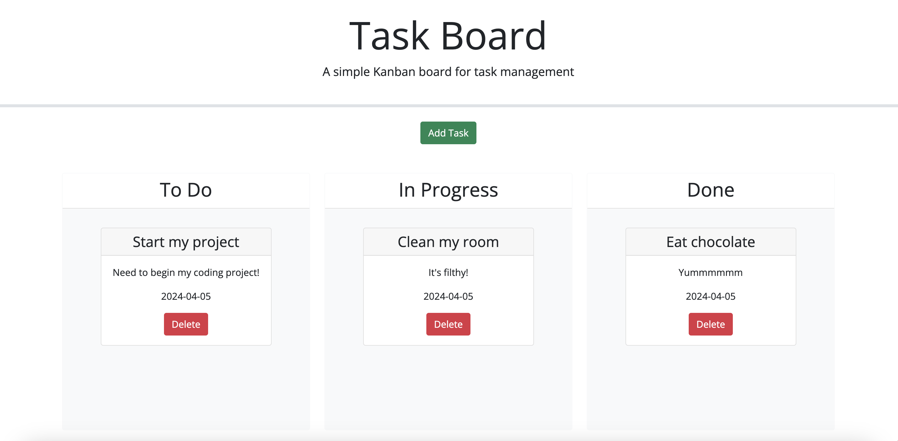

# Task Manager Web App

## Description

This web ap allows you to keep track of all your personal tasks. It keeps track of each task, the due date and alarms you with color based on upcoming dates.

## Usage

Start by clicking "Add Task." You'll be prompted to add a task title, due date and description. Once finalized, that task will be added to the "to-do" section. When you begin your task, drag and drop it in the "in progress" section. Once fully completed, drag and drop into the "done" section. You'll be able to easily keep track of all of your tasks!

## License

Please refer to the license in the repo.

